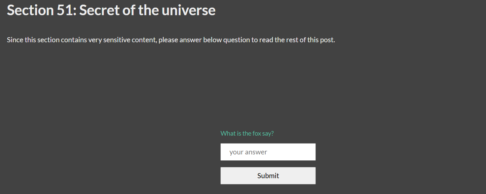

# hugocrypter

Inspired by [hugomods's encrypt](https://hugomods.com/docs/content/encrypt/) and forked from [hugoArticleEncryptor](https://github.com/hotjuicew/hugoArticleEncryptor)

hugocrypter is a tool for encrypting Hugo partial or full [Hugo blog articles](https://gohugo.io/). It has following features:
 - Uses the AES-GCM algorithm for encryption, and decryption article's content
 - Remember password to auto decrypt



## [DEMO](https://juicebar-demo.add1.dev/)
(The password for this post is password)

## Installation
To get the CLI tool, you can either download from the Github [releases](https://github.com/nhuongmh/hugocrypter/releases) or install from source.
```bash
go install github.com/nhuongmh/hugocrypter@latest
```
Then you’re able to access the command via
```bash
$HOME/go/bin/hugocrypter
```

## Note

 - ⚠️ Important Security Note ⚠️Because input password is display as plain text, I highly recommend you to keep your blog repository in **private**.
 - hugocrypter only works on the "posts" folder (or "post" folder) under your "content" directory.


## Usage

### Help:

```bash
[root@localhost]$ ./hugocrypter --help
Usage: ./hugocrypter [command]
Available commands:
  pre    - Execute pre-processing tasks
  post   - Execute post-processing tasks
--help   - Show this help message
 -f       - Force overwrite in pre-build process step
If no command specified, full process will be executed: pre-process -> hugo (build) -> post-process
```

### Mark which content to encrypt

Before building, you can mark which session of your posts need encryption by using shortcodes
```markdown

## Section 51
This section contains very sensitive info, so it need encryption that only allow user with correct password to view.
If you're reading this, then you have the password.

```
You can input password, title of password dialog, and response text when user enter wrong password from the shortcode. 
To avoid repetitive, you can set this in hugo config file
Example in hugo.yaml
```yaml
params:
    secret:
        title: What is the fox say?
        password: kqueekquee
        repOnFail: Uh oh! not like that
```
If none of above provided, hugocrypter will use default password, which is `hugocrypter`

### Build site

You can ask hugocrypter to copy `secret` shortcode and necessary Javascript files into project by using command at root of hugo project:
```bash
hugocrypter pre
```
Then you can build your site with command `hugo` or whatever. If the build success, it will generate site content into `public/` directory. After this step, no content is encrypted yet. 

To encrypt the posts, use command:
```bash
hugocrypter post
```
hugocrypter will looking for each .html files in `public/` and replace the original content with encrypted data.

If your build command is simply `hugo`, you can call `hugocrypter` without any arguments. It will do pre-build process, build and post-build process automatically:
```bash
hugocrypter
```
Equivalent to
```bash
hugocrypter pre && hugo && hugocrypter post
```

### Test 

As hugocrypter only works with built site content, `hugo serve` will not work and you have to use external http server:
Example using python:
```bash
python3 -m http.server -b 0.0.0.0 -d public 1313
```
Example using nodejs:
```bash
# to install http-server: npm install --global http-server
http-server -p 1313 public
```

### Configuration on Platforms like Netlify

You can specify build command as follow
```bash
hugo mod get -u; go install github.com/nhuongmh/hugocrypter@latest; $(go env GOPATH)/bin/hugocrypter
```
